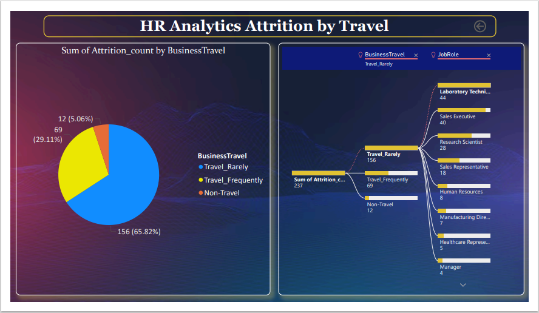

# HR_Analytics_Project

Objective: 

The primary objective of this project was to analyze employee attrition patterns within the organization and identify factors contributing to turnover. This insight aims to help the organization design effective employee retention strategies, reduce attrition rates, and enhance workforce stability.

I developed an HR Analytics Dashboard using Power BI, focusing on employee attrition analysis. This project provided key insights into attrition trends by age group, education, job roles, salary slabs, and business travel patterns. The dashboard revealed that 68.78% of attrition cases came from lower salary brackets, with employees aged 26-35 contributing the most to turnover. Interactive features like slicers and filters allowed dynamic data exploration, empowering HR teams to design targeted retention strategies. Key highlights include a detailed breakdown of attrition by job roles, with Laboratory Technicians and Sales Executives showing the highest turnover. This project demonstrates the value of data visualization in identifying critical workforce challenges and driving actionable HR decisions.

Conclusion:

This dashboard successfully highlights key patterns in employee attrition, providing actionable insights to HR teams. The primary drivers of attrition include:
1.Younger age groups, particularly 26-35 years.
2.Roles with high demand, such as Laboratory Technicians and Sales Executives.
3.Low salary brackets and fewer years of tenure.
4.Employees with frequent or rare travel schedules.

  

